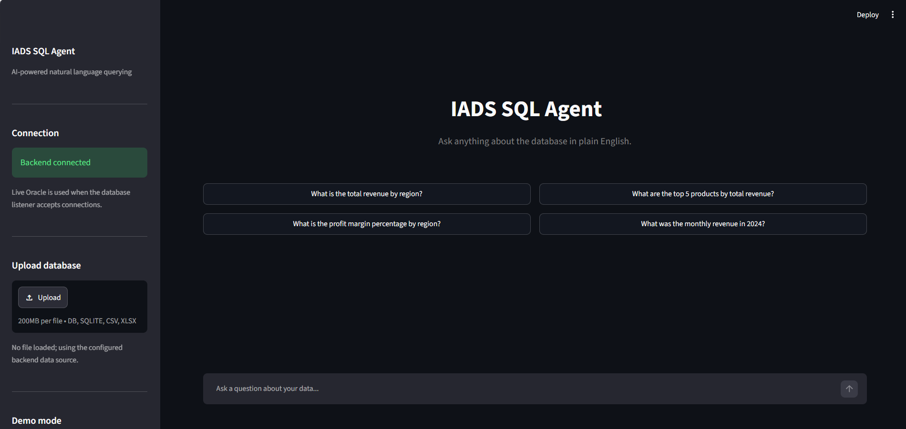
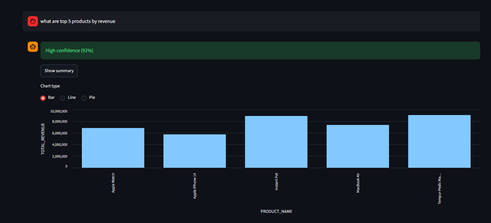
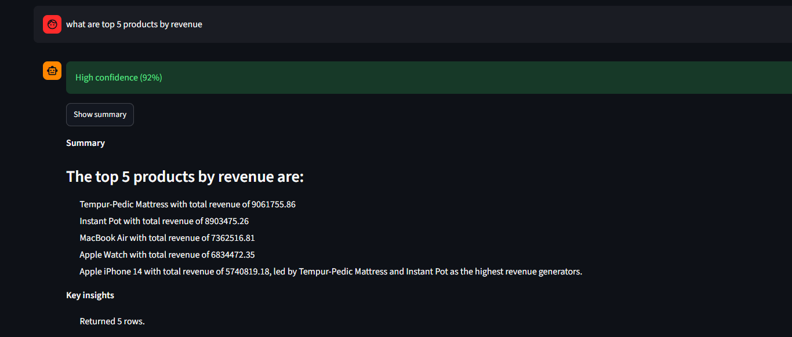
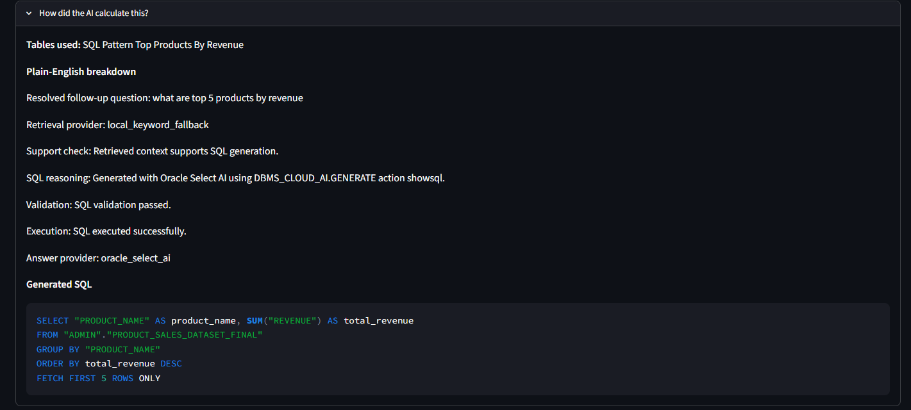
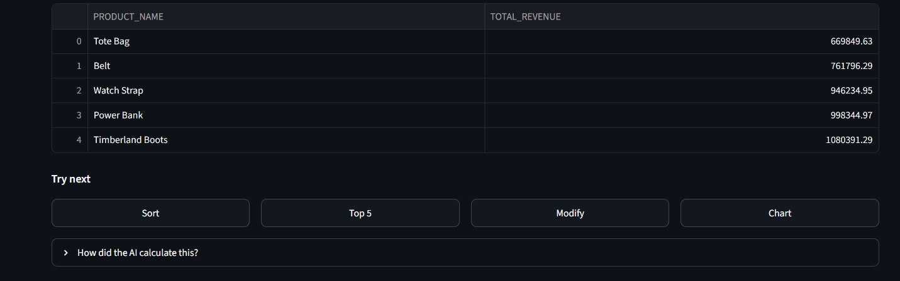

# IADS SQL Agent

> First-place winning agentic text-to-SQL system built on Oracle Cloud Infrastructure.
> Team 4 - IADS Agentic AI Hackathon 2026.

## Hackathon Achievement

This project won **1st place** at the **IADS Agentic AI Hackathon 2026**, held at the
**University of Essex** from **2-4 June 2026**.

The hackathon was organized and supported by:

- **University of Essex**
- **Institute for Analytics and Data Science (IADS)**
- **Enigen**
- **Oracle Cloud Infrastructure**

This was built as a **team project** under the supervision of **Dr Haider Raza**
from the University of Essex. The winning certificate was issued by the Institute
for Analytics and Data Science (IADS), University of Essex, with representatives
from the University of Essex and Enigen.

## What It Does

Ask a business question in plain English. The system retrieves relevant schema and
business context, generates safe Oracle SQL, validates it, executes it, and returns
an answer with the table and explanation behind the result.

```text
You: "Which product category generated the most revenue last quarter in the UK?"

Agent: Electronics generated GBP 4.2M in Q1 2026, up 18% year-on-year.
       - based on 12,847 rows of sales data

       SQL: SELECT product_category, SUM(revenue) AS total
            FROM sales
            WHERE region = 'UK' AND quarter = '2026-Q1'
            GROUP BY product_category
            ORDER BY total DESC
            FETCH FIRST 5 ROWS ONLY;
```

## Chatbot Demo

The Streamlit chatbot is designed as an end-to-end analytics workspace: the user
can ask a question, inspect the answer, switch chart types, open a plain-English
summary, and expand the calculation trace to see the generated SQL and reasoning.

### Start Screen And Connection State



The home screen shows the chatbot entry point, backend connection status, optional
database upload control, and suggested starter questions. The sidebar confirms
whether the backend is connected and whether the app is using the configured data
source.

### Chart Options



When a query returns numeric data, the UI can visualize the result. Users can
switch between chart types such as **Bar**, **Line**, and **Pie** without changing
the underlying SQL result. This is useful when the same answer needs to be viewed
as a ranking, a trend, or a share-of-total comparison.

### Optional Summary



The **Show summary** button opens a concise natural-language explanation of the
result. It turns the returned table into a business-readable answer and highlights
key insights such as the number of rows returned and the leading values.

### Explainability: How The AI Calculated The Answer



The **How did the AI calculate this?** section exposes the reasoning trace behind
the answer. It shows the retrieved context, support check, SQL generation method,
validation result, execution status, answer provider, and the generated SQL. This
keeps the system auditable instead of hiding the query logic behind the chatbot.

### Follow-Up Suggestions And Result Actions



After a response, the chatbot suggests useful next actions such as sorting,
limiting to a top-N view, modifying the query, or charting the result. These
follow-ups are handled by the action classifier so the system knows whether to
reuse the cached result, modify the previous SQL, or run a fresh query.

## Architecture

A multi-stage agentic pipeline. See [`docs/ARCHITECTURE.md`](docs/ARCHITECTURE.md)
for the full design.

```text
User question
   |
[Intent + Action Classifier]
   |
   |-- RUN_NEW_SQL ------------.
   |-- MODIFY_PREVIOUS_SQL ----+--> [Planner] -> [Oracle Vector RAG]
   |-- TRANSFORM_PREVIOUS_RESULT     |              |
   |          |                      |              v
   |          v                      '------> [SQL Generator / Select AI]
   |   [Cached Result Memory]                       |
   |          |                                      v
   |          '------------------------------> [SQL Validator]
   |                                                 |
   |                                                 v
   |                                          [Safe Executor]
   |                                                 |
   |                                                 v
   |                                      [Reflector / Retry Logic]
   |                                                 |
   |                                                 v
   |                                      [Summariser + Confidence]
   |                                                 |
   |                                                 v
   |                                           Response + Explanation
```

The system combines agentic planning, retrieval-augmented generation, Oracle Select
AI, SQL safety checks, cached conversation memory, explainability, and a Streamlit
chat interface.

## What Makes It Innovative

The project is not a simple text-to-SQL demo. It is an agentic analytics workflow
designed to decide **what kind of action** the user wants before generating SQL.

- **LLM action classifier before SQL generation**: each user prompt is classified
  into `RUN_NEW_SQL`, `TRANSFORM_PREVIOUS_RESULT`, `MODIFY_PREVIOUS_SQL`, or
  `ASK_CLARIFICATION`. This prevents follow-up prompts such as "sort them
  ascendingly" from accidentally querying the full database again.
- **Planner for complex analytical questions**: the planner detects questions
  involving comparison, trends, growth, reasons, differences, or "why" analysis.
  Simple questions stay single-step, while complex questions can be decomposed
  into sub-questions with Oracle Select AI.
- **Oracle-grounded RAG layer**: the retriever gives the SQL generator business
  context from schema knowledge, KPI definitions, business rules, SQL patterns,
  dataset documentation, previous analyses, and glossary terms.
- **Safe SQL generation and validation**: SQL is generated as a read-only query,
  then validated before execution to block unsafe operations such as `DELETE`,
  `UPDATE`, `DROP`, `INSERT`, or `MERGE`.
- **Reflector agent for correction**: failed SQL, missing SQL, or empty result
  sets can be detected and sent through a reflection step to request corrected
  SQL instead of silently returning a poor answer.
- **Conversation-aware memory**: the system distinguishes between transforming
  the visible cached result and modifying the previous SQL. This supports prompts
  like "which of them contain Dixon", "explain this", "for 2024 only", and
  "compare this product across years".
- **Confidence scoring**: the API exposes a confidence value based on support
  checks, generation status, execution status, and fallback behavior. The UI
  surfaces this as high or low confidence so users know when to double-check.
- **Explainability by design**: the interface exposes how the answer was produced:
  retrieved context, support check, SQL reasoning, validation, execution status,
  and answer provider.
- **Oracle infrastructure integration**: the system is designed around Oracle
  Autonomous Database, Oracle Vector Search, Oracle Select AI, and OCI Generative
  AI services rather than an isolated local prototype.

## Key Capabilities

- Natural-language business questions over structured Oracle data
- Oracle-based RAG using schema knowledge, KPI definitions, business rules, SQL
  patterns, dataset documentation, previous analyses, and glossary context
- Select AI-backed SQL generation and agentic planning
- SQL validation and read-only guardrails before execution
- Cached-result memory for follow-up prompts such as sorting, filtering, explaining,
  or comparing previous outputs
- Reflector/retry logic for failed SQL, empty results, or missing SQL
- Explainability panel showing how the answer was calculated
- Streamlit frontend with tables, charts, summaries, and suggested follow-up prompts

## Quick Start

```bash
# Install
make dev

# Configure
cp .env.example .env  # then edit with your OCI and Oracle credentials

# Run
make run-api    # FastAPI at http://localhost:8000
make run-ui     # Streamlit at http://localhost:8501
```

## Repository Layout

```text
src/sql_agent/      Core package
  config/           Typed settings
  core/             Domain models, exceptions, logging
  llm/              OCI Generative AI client
  retrieval/        Schema embeddings + vector store (RAG)
  database/         Autonomous DB connection + safe executor
  agents/           Multi-stage pipeline + orchestrator
  safety/           SQL guard rails
  api/              FastAPI app

app/                Hackathon application pipeline and agents
frontend/           Streamlit UI
evaluation/         Benchmark harness
tests/              Unit + integration tests
prompts/            Versioned prompt templates
docs/               Architecture + decision records
scripts/            Seed DB, embed schema, run benchmark
```

## Team

This was a collaborative hackathon build delivered by **Team 4**. The project was
developed as a team effort across agent design, Oracle integration, RAG, SQL
safety, backend services, frontend experience, evaluation, and presentation.

Full file-level ownership and Day 1/2/3 plan: [`docs/OWNERSHIP.md`](docs/OWNERSHIP.md).

## Documents

- [`docs/ARCHITECTURE.md`](docs/ARCHITECTURE.md) - system design and path to production
- [`docs/decisions/`](docs/decisions/) - architecture decision records (ADRs)

## Licence

MIT
